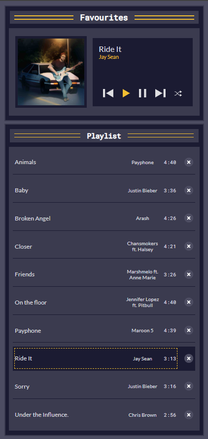

# Music Player App

A simple music player app built using HTML, CSS, and JavaScript. The app allows users to play, pause, skip, shuffle, and delete songs from a playlist. It demonstrates basic string and array methods and provides an interactive way to learn how to manipulate these data structures.

## Features

- **Play/Pause**: Play or pause the current song.
- **Next/Previous**: Navigate between songs in the playlist.
- **Shuffle**: Shuffle the order of the songs in the playlist.
- **Delete**: Delete a song from the playlist.
- **Reset Playlist**: Reset the playlist to its original state.
- **Playlist Management**: View and interact with the playlist of songs.

## Technologies Used

- **HTML**: Structure and layout of the app.
- **CSS**: Styling for the user interface.
- **JavaScript**: Functionality for controlling the music player and playlist interactions.

## Setup

To run the music player app on your local machine, follow these steps:

1. Clone the repository:

2. Open the index.html in a browser

## Code Breakdown

playSong(id):           Plays the selected song.

pauseSong():            Pauses the current song.

playNextSong():         Plays the next song in the playlist.

playPreviousSong():     Plays the previous song in the playlist.

shuffle():              Randomizes the playlist order.

deleteSong(id):         Deletes a song from the playlist.

setPlayerDisplay():     Updates the display with the current song's title, artist, and album art.

*attributes of playlist*
Title:  The song's name.
Artist: The artist(s) who performed the song.
Duration: Length of the song.
Source: The source URL or path to the audio file.

*Usage*
To interact with the app, use the following features:

**Play/Pause**: Click the play/pause button to toggle playback.
**Next Song**: Click the next button to skip to the next song in the playlist.
**Previous Song**: Click the previous button to go back to the previous song.
**Shuffle**: Click the shuffle button to randomize the playlist.
**Delete Song**: Click the delete icon next to a song to remove it from the playlist.
**Reset Playlist**: Click the reset button to restore the playlist to its original state.
<<<<<<< HEAD

## Screenshot of the page

Below is the preview of the music player

